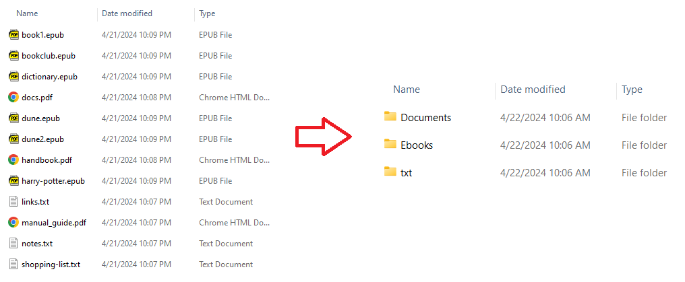
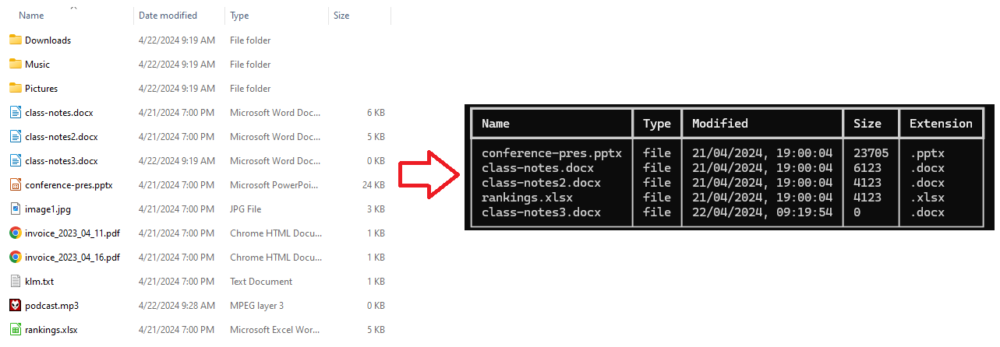
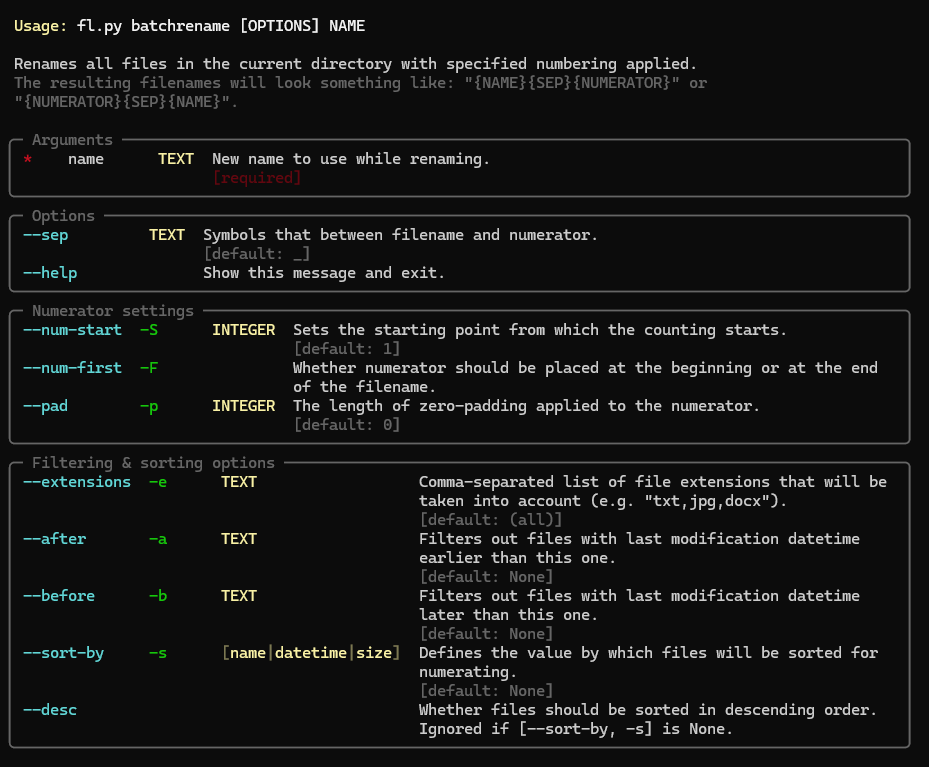

# :floppy_disk: FileLynx - a handy file organising tool

FileLynx is a command line tool conceived out of a need to manage local files and folders
quicker and more efficiently. It provides useful commands for batch operations like categorising and renaming multiple
files based on given conditions.

The project's actively being developed and more features are planned to be added. 

## Features

Currently, the program supports the following commands:
- `groupby` - easy grouping files into subfolders

For example:
```commandline
fl groupby ext --map pdf>Documents --map epub>Ebooks 
```



Files can be grouped based on metadata such as file extension or modification date.

- `batchrename` - quick renaming of multiple files with powerful filtering and sorting options

For example:
```commandline
fl batchrename "holiday2024" -e jpg,jpeg,png -s datetime --after 1-7-2023_0:0:0 --before 31-8-2023_23:59:59
```

- `show` - a clean display of current directory contents

For example:
```commandline
fl show -sort-by size -e docx,xlsx,pptx --desc
```



- rich command usage guides with `--help`




## How to run

The program requires Python 3 to be installed on the local machine.
Packaging the application and uploading to the PyPI repository is planned. For the time being, you'll need to follow
the steps below to run the app:

1. Clone the repository

    ```commandline
    git clone https://github.com/jlynxdev/file-lynx.git
    ```
    Project's dependencies are listed in the `requirements.txt` file. They can be installed this way:
    ```commandline
    cd path/to/project/folder
    pip install -r requirements.txt
    ```
    You're encouraged to run the program in a virtual environment (you can create one with e.g. Python's venv tool or
    virtualenv), though it's not strictly necessary.


2. Use the `python` command with the path to the `fl.py` module - it contains the actual command-line application
implementation
    ```commandline
    py path/to/fl.py [COMMAND] [ARGUMENTS] [OPTIONS]
    # examples
    py path/to/fl.py --version
    py path/to/fl.py show --help
    ```

## Roadmap

Since the project is in a state of active development, many more features are going to be added in the near future.
Among the most important ones are:
- publishing the program as a standalone package on the PyPI repository
- adding a command for convenient and flexible moving of files
- adding commands for some other batch operations and selecting files